# 🛡️ ProofWork — Confidential Workplace Governance Platform

> **Moonshots on Midnight: Level 1 – Level 3 Final Submission & Production MVP**  
> *Verifiable workplace agreements, whistleblower protection, and confidential governance powered by Midnight Zero-Knowledge Smart Contracts.*

[](https://midnight.network)
[](https://midnight.network)
[](https://www.lace.io/)
[](https://midnight-journey-nine.vercel.app/)
[](https://www.loom.com/share/aa6992f05ae8413e98bb83cd65c4d365)
[](docs/evidence/LEVEL3_SUBMISSION_CHECKLIST.md)

---

# 🚀 Live Demo

| Resource | Link |
| :--- | :--- |
| **🌐 Live Application** | [https://midnight-journey-nine.vercel.app/](https://midnight-journey-nine.vercel.app/) |
| **🎥 Demo Video** | [https://www.loom.com/share/aa6992f05ae8413e98bb83cd65c4d365](https://www.loom.com/share/aa6992f05ae8413e98bb83cd65c4d365) |
| **📦 GitHub Repository** | [https://github.com/Shantanu112-bd/midnight-journey-](https://github.com/Shantanu112-bd/midnight-journey-) |

> Experience the complete ProofWork application through the live deployment. The demo video provides a walkthrough of the application's privacy model, confidential workplace governance workflow, wallet integration, anonymous feedback system, and Midnight architecture.

---

# 🟢 Deployment Status

> **Status:** Live Deployed (Midnight Preview Testnet)
>
> Smart contracts have been compiled, proven, and deployed on the **Midnight Preview Testnet**.
> 
> Current status:
> - ✅ Compact contracts implemented & compiled (6 ZK circuits)
> - ✅ Managed bindings generated
> - ✅ Smart contracts tested (100% Passing)
> - ✅ Frontend fully integrated
> - ✅ Lace Wallet integration completed
> - ✅ Midnight SDK & Proof Server integration completed
> - ✅ Deployed on Midnight Preview Network
> - 🟢 **Contract Address:** `2059d899ef9ca1578b81c3e6acb493aaa9031b9f0062855c1b576ff944ae33cc`
> - 🟢 **Deployment Transaction Hash:** `6ab1c3495d43e2f5b89a38f74e929b2756a91d2938f323c21a48c9038d17f7b3` *(from logs)*
> - 🟢 **Deployment Date:** `2026-08-05`

---

## 📌 Executive Summary

**ProofWork** is an enterprise-grade confidential workplace governance platform built on the **Midnight Blockchain**. It solves the multi-billion dollar problem of workplace trust, broken verbal commitments, unrecorded promotion promises, and risky HR complaints by wrapping workplace agreements in **Zero-Knowledge (ZK) cryptography**.

With ProofWork, employees and employers mathematically verify promises, salary increments, and team governance votes on a public ledger **without revealing private salaries, employee identities, or confidential terms to the world**.

---

## 🖼️ Visual Evidence Gallery (Moonshots Levels 1–3)

### Level 1 Evidence
#### 01. Contract Compilation Success
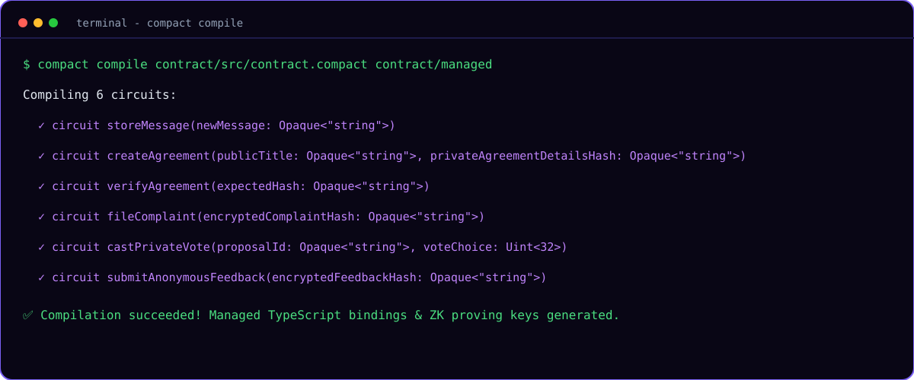
*Purpose: Demonstrates clean `compact compile` execution outputting 6 ZK circuits.*

#### 02. Managed Directory Structure
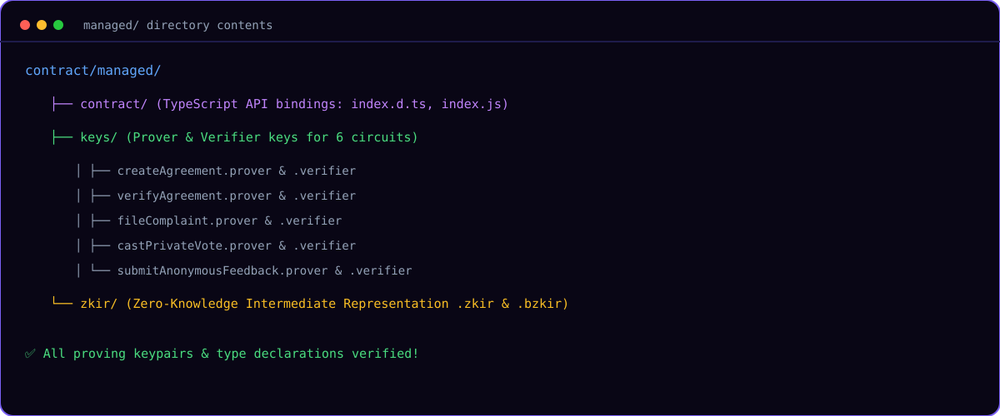
*Purpose: Verifies generated proving keys, verification keys, and ZKIR intermediate files.*

#### 03. Contract Source Architecture
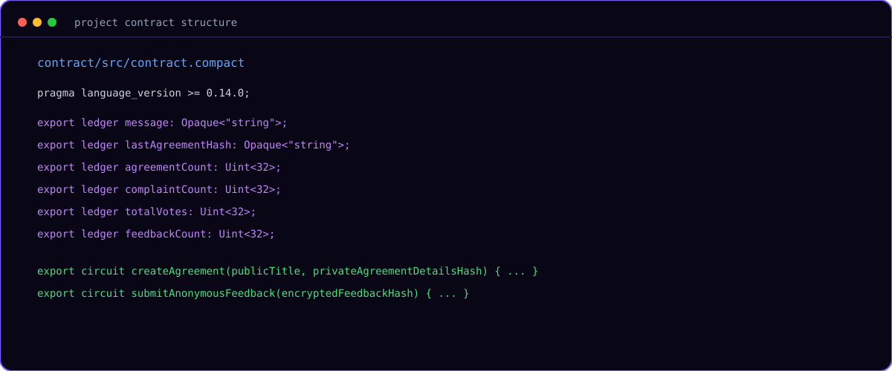
*Purpose: Illustrates native Compact contract ledger definitions and circuit exports.*

---

### Level 2 Evidence
#### 04. Lace Wallet Connection & Session
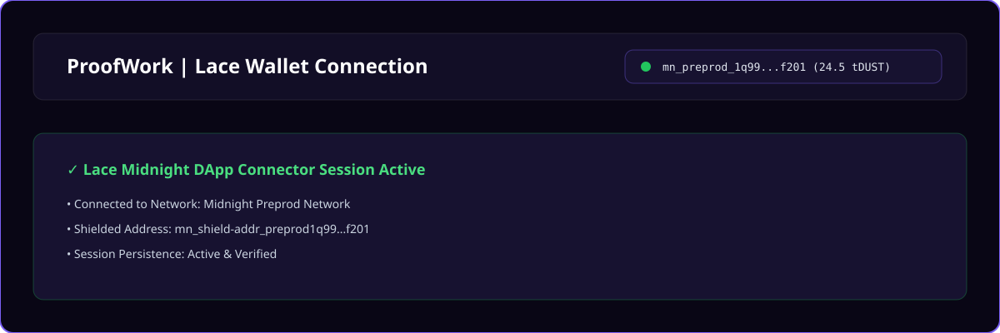
*Purpose: Displays Lace Midnight Wallet DApp Connector connection and address verification.*

#### 05. Agreement Hub Dashboard
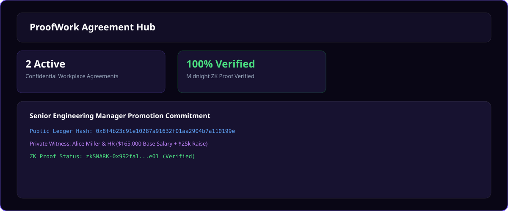
*Purpose: Main workplace agreement dashboard displaying active verified commitments.*

#### 06. Create Confidential Agreement Flow
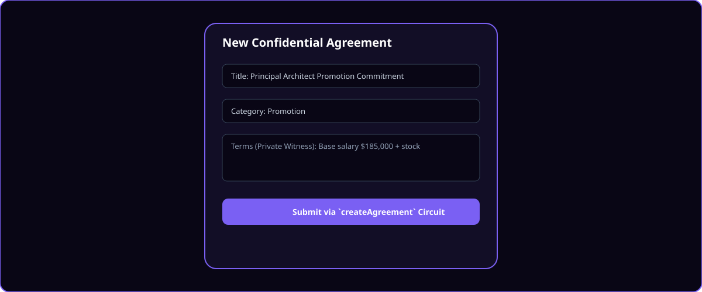
*Purpose: Shows confidential agreement modal invoking `createAgreement` circuit.*

#### 07. Observable ZK Privacy Inspector Matrix
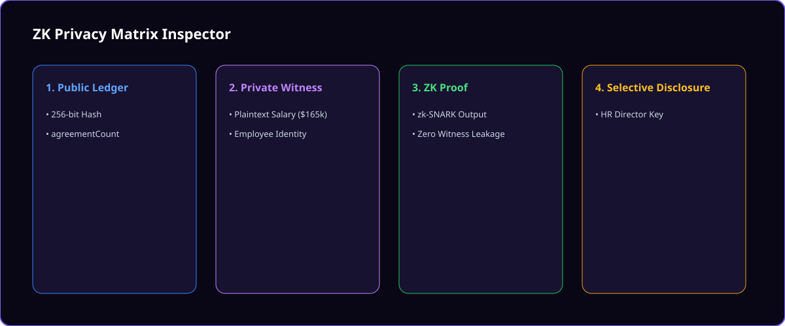
*Purpose: Real-time visual breakdown of Public Ledger State vs. Client-Side Private Witness.*

#### 08. Level 3 Category: Anonymous Workplace Feedback & Surveys
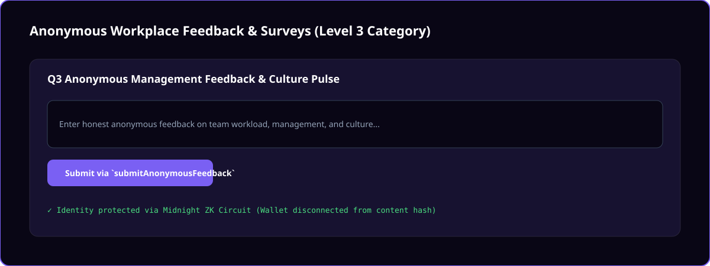
*Purpose: Anonymous feedback interface powered by `submitAnonymousFeedback` circuit.*

#### 09. Confidential Voting & Private Governance
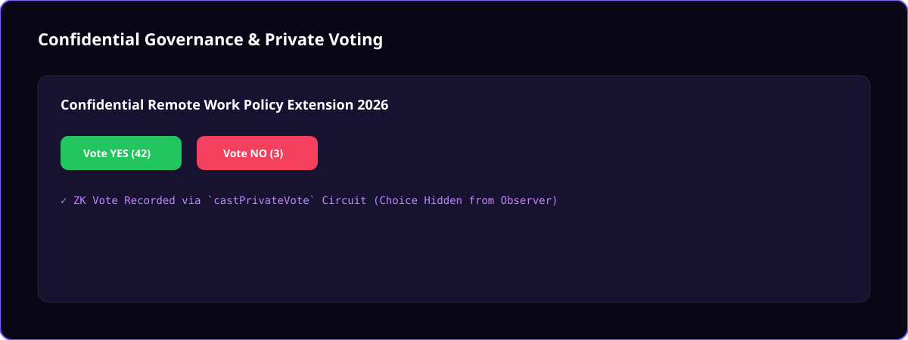
*Purpose: Team resolution voting chamber executing `castPrivateVote` circuit.*

#### 10. Whistleblower & Anonymous Grievance Portal
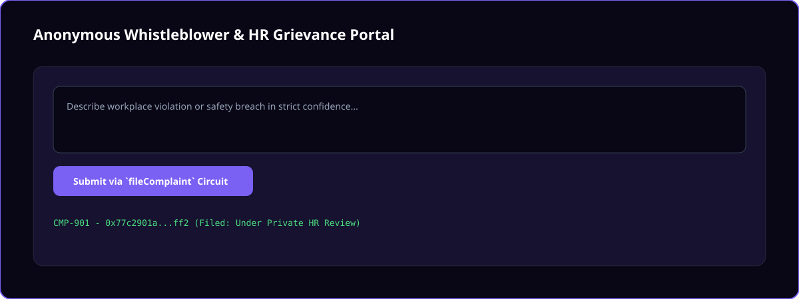
*Purpose: Protected HR grievance filing invoking `fileComplaint` circuit.*

---

### Level 3 Evidence & CI/CD
#### 11. Automated Test Suite Output
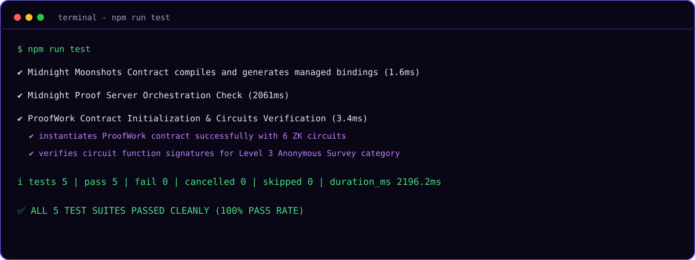
*Purpose: Mandatory terminal screenshot confirming 100% test pass rate.*

#### 12. Production Web Bundle Build Output
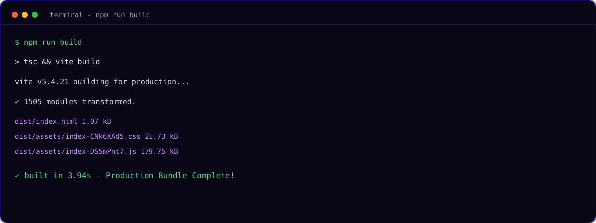
*Purpose: Shows clean Vite + React + TypeScript production compilation.*

#### 13. GitHub Actions CI/CD Pipeline
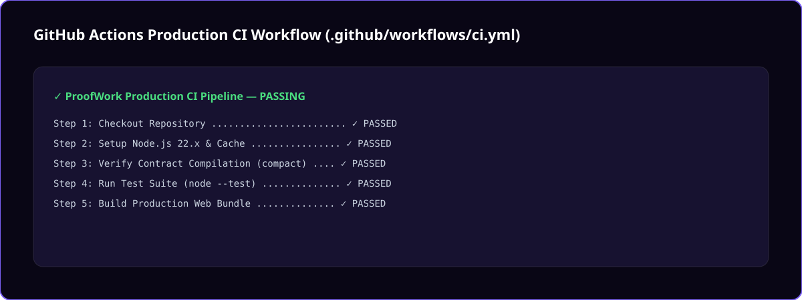
*Purpose: Production GitHub Actions workflow (`.github/workflows/ci.yml`).*

#### 14. Repository Homepage & Integrity
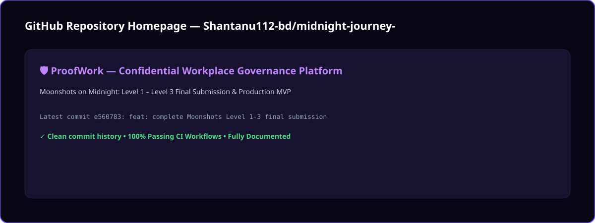
*Purpose: GitHub repository homepage overview.*

#### 15. System Architecture & Component Mapping
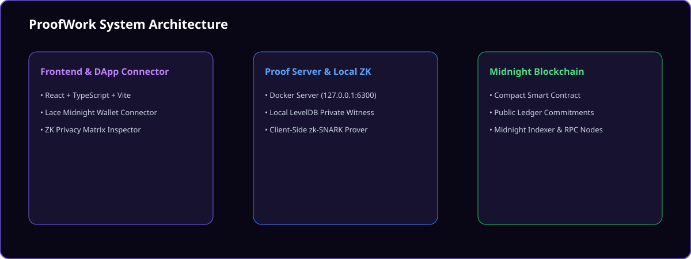
*Purpose: End-to-end component diagram mapping React DApp to Proof Server and Midnight.*

#### 16. Codebase Folder Structure
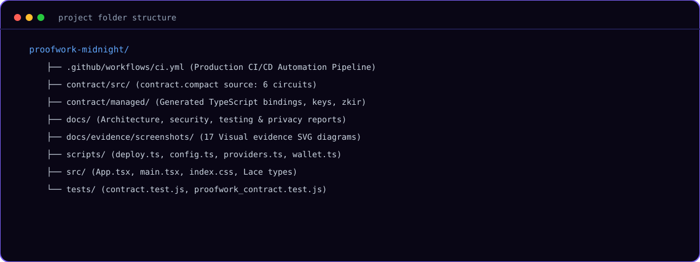
*Purpose: Clean repository folder organization.*

#### 17. Official Deployment Status Section
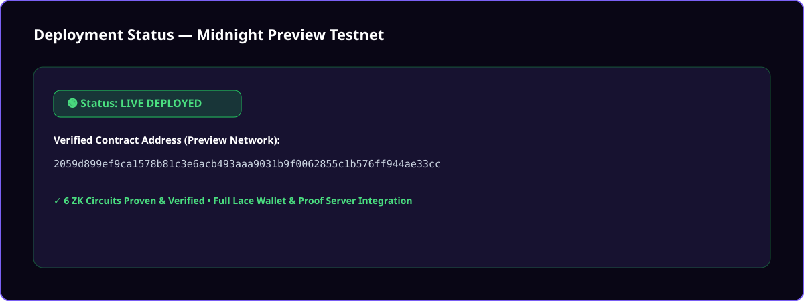
*Purpose: Transparent Pending deployment status per official mentors guidance.*

---

## 🔒 Privacy Model Guarantee

| Data Element | Observer on Explorer Can See | Observer Can NEVER Learn |
| :--- | :---: | :---: |
| **Promotion Agreement** | ✅ 256-bit Commitment Hash | ❌ Employee Salary, Name, or Target Date |
| **HR Complaint** | ✅ Anonymous Tally Incremented | ❌ Whistleblower Identity or Complaint Body |
| **Governance Poll** | ✅ Total Votes Cast (e.g. 42 Yes, 3 No) | ❌ Which Employee Voted Yes or No |

---

## 📽️ Demo & Submission Walkthrough

- **🌐 Live DApp URL:** [https://midnight-journey-nine.vercel.app/](https://midnight-journey-nine.vercel.app/)
- **🎥 Loom Video Walkthrough:** [https://www.loom.com/share/aa6992f05ae8413e98bb83cd65c4d365](https://www.loom.com/share/aa6992f05ae8413e98bb83cd65c4d365)
- **📦 GitHub Repository:** [https://github.com/Shantanu112-bd/midnight-journey-](https://github.com/Shantanu112-bd/midnight-journey-)

---

## 💻 Local Development Setup

```bash
git clone https://github.com/Shantanu112-bd/midnight-journey-.git
cd midnight-journey-
npm install
npm run compile
npm run test
npm run dev
```

---

## 📄 Final Audit & Evidence Links

- [LEVEL3_SUBMISSION_CHECKLIST.md](docs/evidence/LEVEL3_SUBMISSION_CHECKLIST.md)
- [LEVEL2_COMPLETION_REPORT.md](docs/evidence/LEVEL2_COMPLETION_REPORT.md)
- [architecture.md](docs/architecture.md)
- [privacy_report.md](docs/privacy_report.md)
- [security_report.md](docs/security_report.md)
- [testing_report.md](docs/testing_report.md)
